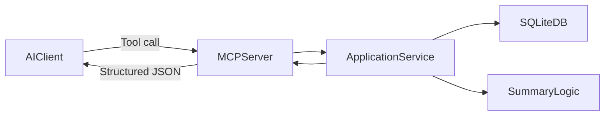

# MCP Documentation

## Overview

This document describes the MCP layer in the ABC CRM/SFA POC:

- what the MCP server does
- available MCP tools
- input/output contracts
- how to run and test
- integration expectations for AI agents

The MCP server is implemented in `mcp_server/server.py` and uses the application layer (`application/`) as its data source.

## Architecture

High-level flow:

1. AI client calls MCP tool.
2. MCP tool validates input and delegates to application service.
3. Application service reads SQLite data and composes 360 output.
4. MCP tool returns structured JSON response (or safe error).



## MCP Server

- Entry point: `python -m mcp_server.server`
- Transport: `stdio`
- Framework: `FastMCP` (`mcp.server.fastmcp`)
- Initialization behavior:
  - config + logging loaded
  - database initialized (`init_db`)
  - seed data inserted (`seed_db`) if DB is empty

## Available MCP Tools

### 1) `health_check()`

Purpose:
- Verify MCP server is running and configured.

Response:

```json
{
  "status": "ok",
  "env": "dev",
  "db_path": "application/data/abc_crm.db"
}
```

---

### 2) `search_entities(query, entity_type)`

Purpose:
- Resolve user text into entity IDs before calling 360 tools.

Inputs:
- `query` (string)
- `entity_type` (string): `account` or `lead`

Success response:

```json
{
  "query": "Acme",
  "entity_type": "account",
  "results": [
    {
      "id": "acc_001",
      "name": "Acme Corp"
    }
  ]
}
```

Error response:

```json
{
  "error": {
    "message": "entity_type must be one of: account, lead",
    "type": "application_error"
  }
}
```

---

### 3) `get_account_360(account_id)`

Purpose:
- Return structured 360 summary for an account.

Input:
- `account_id` (string), e.g. `acc_001`

Response schema:
- `entity`
- `summary`
- `status`
- `health`
- `open_risks`
- `recent_activity`
- `next_actions`
- `sources`

Sample:

```json
{
  "entity": { "type": "account", "id": "acc_001", "name": "Acme Corp" },
  "health": "red",
  "open_risks": ["All open opportunities are in early stages."],
  "recent_activity": [],
  "next_actions": ["Schedule discovery calls with decision makers."],
  "sources": [{ "record_type": "account", "record_id": "acc_001" }]
}
```

---

### 4) `get_lead_360(lead_id)`

Purpose:
- Return structured 360 summary for a lead.

Input:
- `lead_id` (string), e.g. `lead_001`

Response schema:
- `entity`
- `summary`
- `status`
- `health`
- `open_risks`
- `recent_activity`
- `next_actions`
- `sources`

Error response (example):

```json
{
  "error": {
    "message": "Lead not found: lead_missing",
    "type": "application_error"
  }
}
```

## Response Contract

For 360 tools, the stable contract is:

```json
{
  "entity": {
    "type": "account|lead",
    "id": "string",
    "name": "string"
  },
  "summary": "string",
  "status": "healthy|attention|at_risk",
  "health": "green|amber|red",
  "open_risks": ["string"],
  "recent_activity": [
    {
      "id": "string",
      "type": "string",
      "date": "YYYY-MM-DD",
      "summary": "string"
    }
  ],
  "next_actions": ["string", "string", "string"],
  "sources": [
    {
      "record_type": "account|lead|opportunity|activity",
      "record_id": "string"
    }
  ]
}
```

## Error Handling

Design goals:

- Safe errors (no traceback in payload)
- Human-readable message
- Consistent error envelope

Error envelope:

```json
{
  "error": {
    "error_code": "string",
    "message": "string",
    "recoverable": true,
    "type": "application_error"
  }
}
```

## How AI Agents Should Use MCP Tools

Recommended sequence:

1. Call `health_check`.
2. Resolve target with `search_entities`.
3. Call one of:
   - `get_account_360`
   - `get_lead_360`
4. Build final answer from:
   - `open_risks`
   - `next_actions`
   - `sources` (for grounding/auditability)

Best practices:

- Never guess IDs; always resolve first via search.
- Include source record IDs in final user-facing explanation.
- Handle `error` payloads explicitly and retry with corrected input.

## Run and Test

### Start MCP server

```bash
PYTHONPATH=. python -m mcp_server.server
```

or:

```bash
./mcp.sh
```

### Run smoke test (direct function-path validation)

```bash
PYTHONPATH=. python scripts/smoke_test.py
```

### Run unit tests

```bash
PYTHONPATH=. python -m unittest discover -s tests -p "test_*.py"
```

### Prompt checklist

Use:

- `scripts/mcp_prompts.md`

## Configuration

Environment variables:

- `APP_ENV` (default: `dev`)
- `LOG_LEVEL` (default: `INFO`)
- `APP_DB_PATH` (default: `application/data/abc_crm.db`)

## Current Scope and Limits

Current scope:

- Read-only MCP tools
- SQLite sample data
- Rule-based summary logic

Not included by default:

- write/update CRM tools
- role-based authorization by user identity
- production deployment hardening

## File References

- MCP server: `mcp_server/server.py`
- Config: `mcp_server/config.py`
- App service: `application/service.py`
- Summary rules: `application/summary.py`
- DB setup/seed: `application/db.py`
- Smoke test: `scripts/smoke_test.py`
